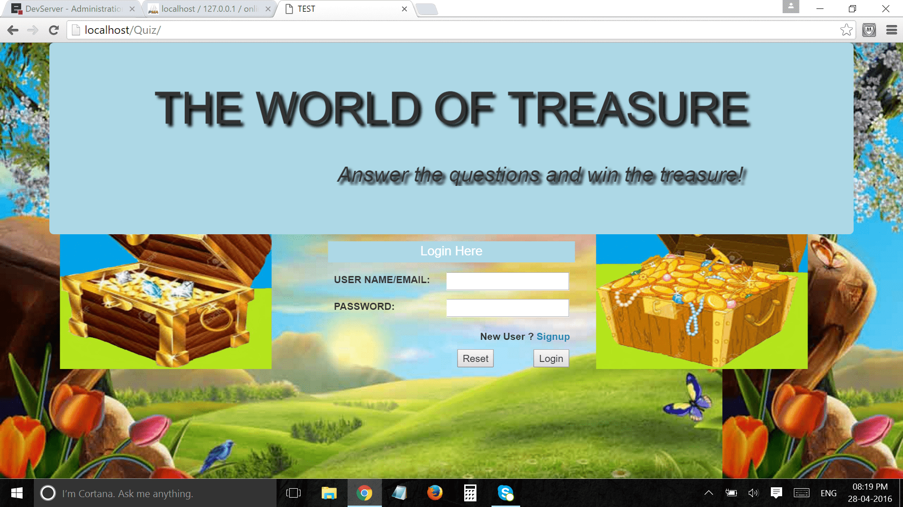
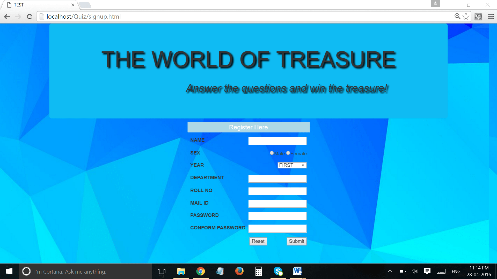
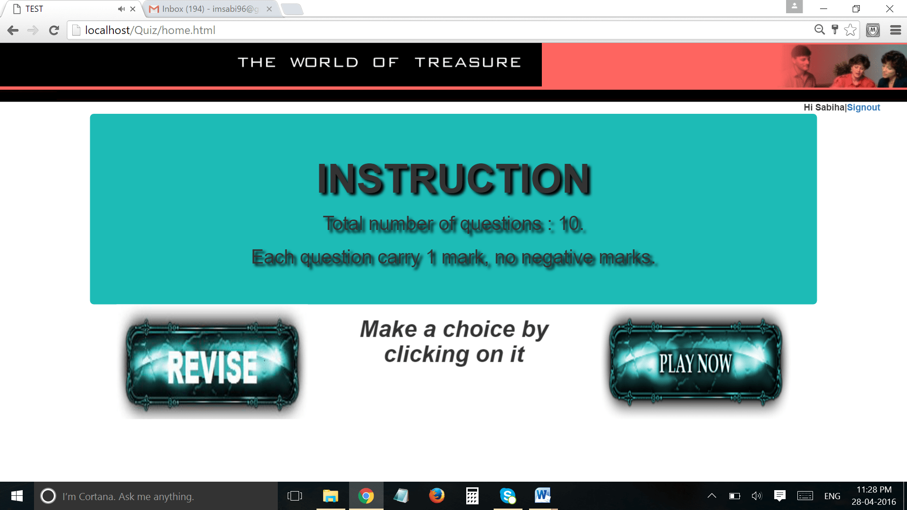
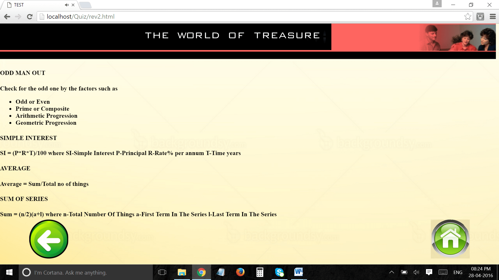
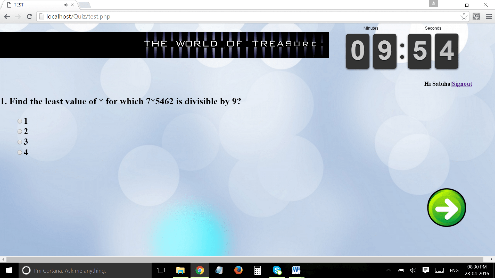
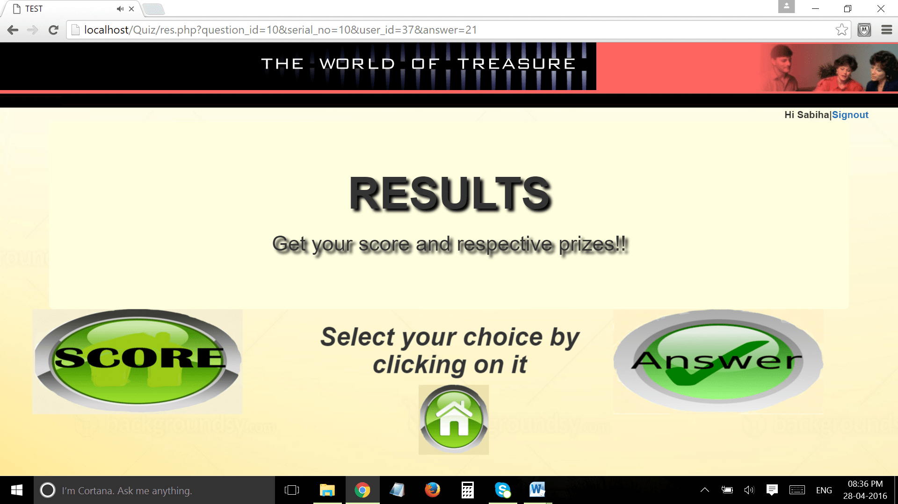
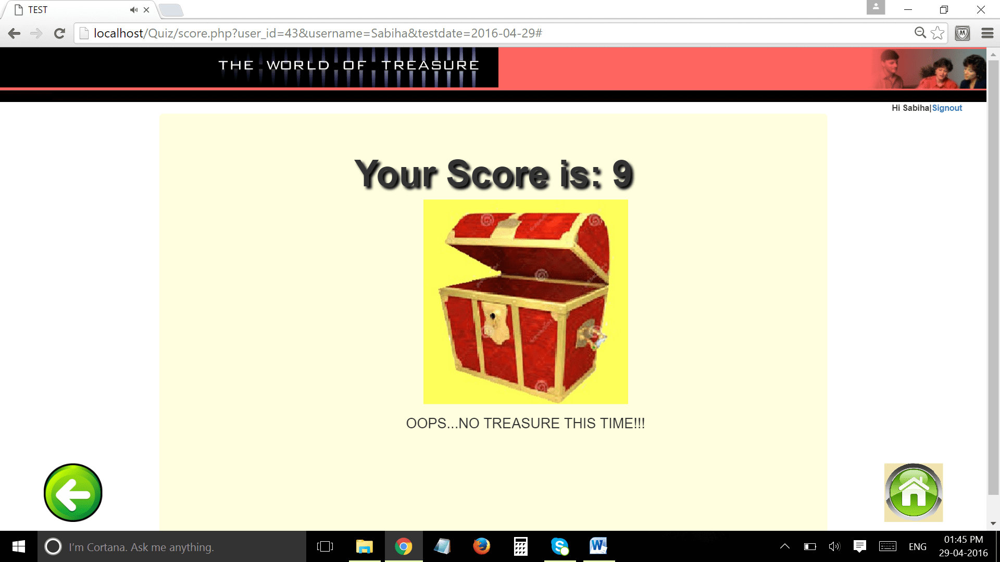
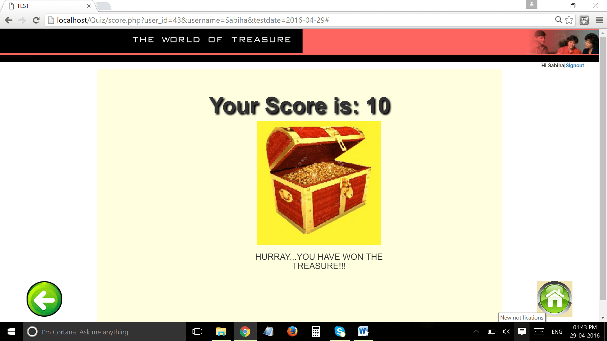
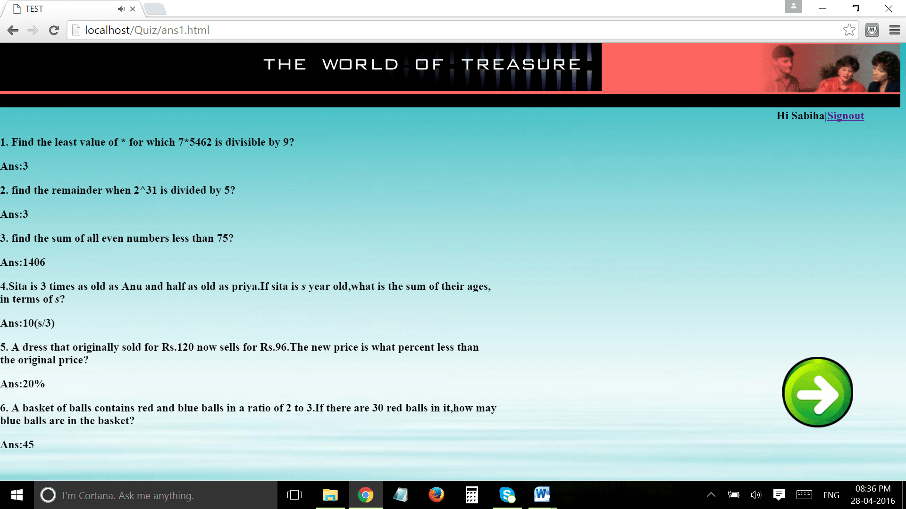
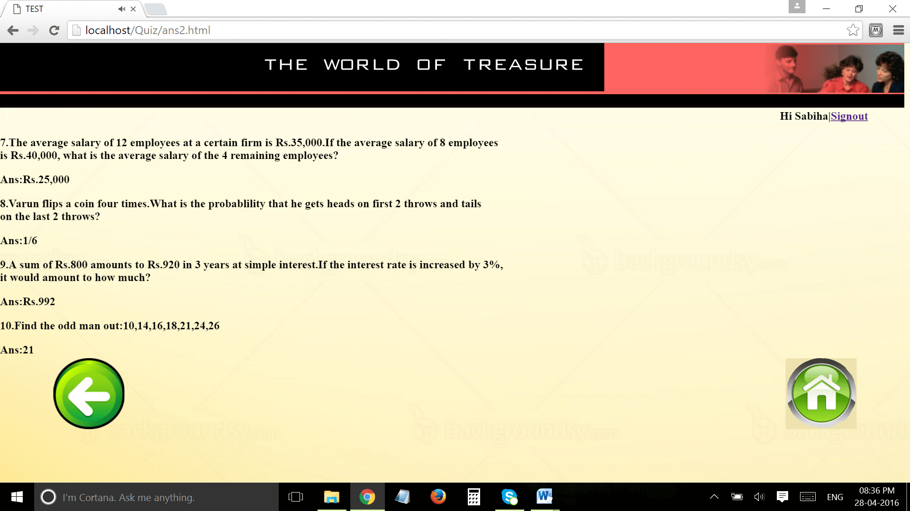

# WORLD OF TREASURE

> World of Treasure is a E-Learning Web Application with a timed quiz which allows students to learn and win the treasure by getting 100% in the quiz. Built using HTML5, CSS3, Bootstrap, MySQL

## Table of contents
* [Technologies](#technologies)
* [Screenshots](#screenshots)
* [Contact](#contact)

## Technologies
* Technologies - HTML5, CSS3,  Bootstrap, MySQL

## Screenshots
 

## Contact
[Sabiha Begum Jaggir Hussain](https://sabihabegumj.com/) - feel free to contact me!
